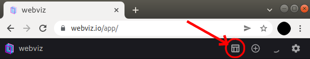
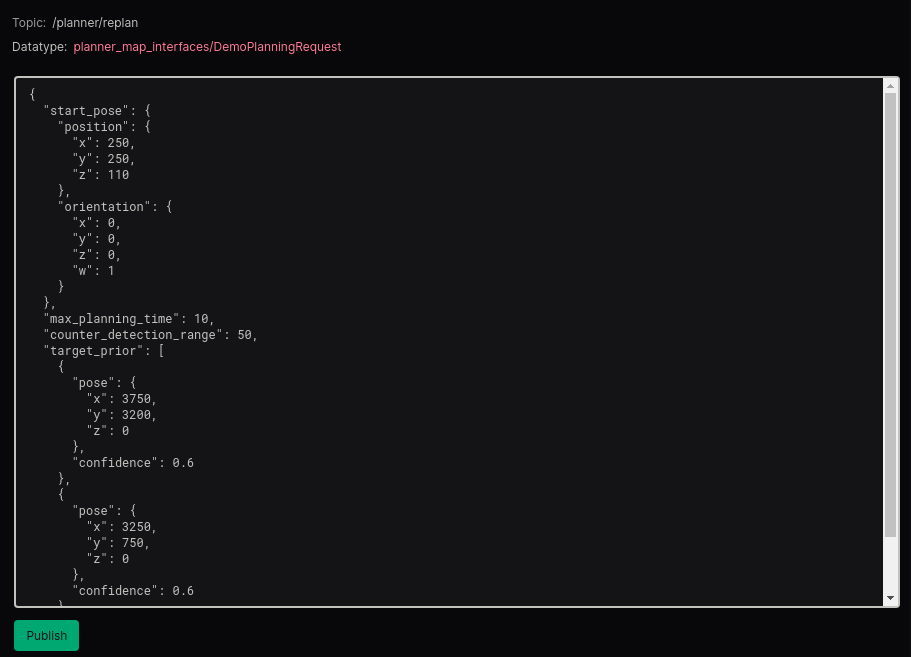
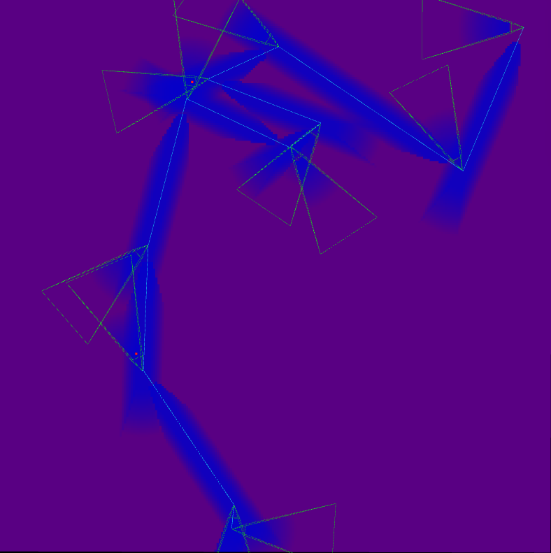

<!--  
Informed Sampling-based Adaptive Path Planner 
-->
 

# Informed Sampling-based Algorithm for Informative Path Planning 

This is an initial version of the Informed Sampling-based Algorithm for Informative Path Planning specifically tailored to perform search and reconnaissance. This demo is intended to showcase the planner algorithm's ability to:

- Autonomously generate flyable plans for a fixed-wing UAV with a forward-facing camera 
- Visit specified priors in its environment
- Explore its environment for other possible targets
- Avoid counter detections from targets

This document details instructions on how to setup the demo, visualize the demo using [Webviz](https://webviz.io/), and interact with the demo using the planner interface's ROS message templates. 

## Table of Contents

1. [Overview](#overview)
2. [Setup and Usage](#usage)
3. [General Tips and Troubleshooting](#tips)

### Overview <a name="overview"></a>

This version of the planner is intended to demonstrate the desired behavior of a fixed-wing UAV searching its environment for objects of interest. Given a _maximum agent range_, an _environment_, and an optional _list of potential targets_ in the environment, the planner generates a tree of potential paths from its starting position and chooses the **"best"** path that expends all of its range and maximizes its information gain. 

Since this demo is not inside a simulator, there is no replanning on-the-fly and the generated paths are static. In a real-world setting, the UAV flying the proposed paths continuously replans on-the-fly, thereby updating its **"current best path"** on-the-fly as it gains new information.

In this demo, the user can interact with the planner by adjusting the:
- start position
- maximum planning time
- list of target positions
- target counter-detection range
- maximum range

Given the above set of parameters, the planner generates a path that is visualized in the web-interface [Webviz](https://webviz.io/). The visualization consists of the following components:
1. The search bounds visualized as a discretized grid of cells. It represents the "belief space" of the planner. Each grid cell represents the probability of a target residing in the cell with a color gradient representing this probability. Blue corresponds with low probability and red represents high probability and purple being values in between (unknown/unseen).
2. Sensor frustrum at end points of path segments are visualized in green. It represents what the UAV "sees" from its current viewpoint. The grid cell values(and hence colors) are modified inside the frustrum. The range of the sensor model dictates how far grid cells can be "successfully" viewed.
<!-- 3. The green lines show candidate paths generated by the tree -->
3. The blue line is the best path flown by the UAV
4. The blue swath underneath the best path represents what the UAV will "see" as it flies the path, thereby modifying the probability values in those grid cells. 

### Setup and Usage <a name="usage"></a>

The compiled planner is containerized in the docker image **onr-planner-demo-feb-22-[arch].tar.gz**. The high-level steps to interact with the docker is to:
1. [Launch the docker image](#dockersetup)
2. Launch the [Webviz App](https://webviz.io/app/)
3. [Copy and paste the Webviz config](#webvizconfig)
4. [Publish the example DemoPlanRequest.msg](#rosmsg)


#### Installing Docker and Using the Docker Image <a name="dockersetup"></a>

Follow these steps from the official Docker website to install Docker on Windows/MacOS/Ubuntu:

[**Installing Docker on Windows**](https://docs.docker.com/desktop/windows/install/)

[**Installing Docker on MacOS**](https://docs.docker.com/desktop/mac/install/)

**Installing Docker on Ubuntu/Linux:**
1. Open the terminal.
2. Remove any previous Docker installations using the following command 
 ```
 $ sudo apt-get remove docker docker-engine docker.io
 ```
3. Check if the system is up-to-date using the following command 
 ```
 $ sudo apt-get update
 ```
4. Install Docker using the following command 
 ```
 $ sudo apt install docker.io
 ```
5. Install all the dependency packages using the following command 
 ```
 $ sudo snap install docker
 ```
6. Before using Docker, check the version installed using the following command 
```
$ docker --version
```

**Using the Docker Image on Ubuntu/Linux/MacOS**
1. Open the terminal.
2. Load the Docker image **onr-planner-demo-feb-22-[arch].tar.gz** using the following command
 ```
 $ docker load < onr-planner-demo-feb-22-[arch].tar.gz
 ```
3. Start the Docker Image in detached mode with container port published to host port 9090
 ```
 $ sudo docker run -dp 9090:9090 onr-planner-demo-feb-22
 ```
4. To close the docker after you are done
 ```
 $ docker stop $(docker ps -a -q)  
 ```

**Using the Docker Image on Windows**
1. Open Powershell in Administrator mode.
2. Load the Docker image **onr-planner-demo-feb-22-[arch].tar.gz** using the following command
 ```
 $ docker load -i .\onr-planner-demo-dec-22-[arch].tar.gz
 ```
3. Start the Docker Image in detached mode with container port published to host port 9090
 ```
 $  docker run -dp 9090:9090 onr-planner-demo-feb-22
 ```
4. To close the docker after you are done
 ```
 $ docker stop $(docker ps -a -q)  
 ```

#### Copy and paste the Webviz config <a name="webvizconfig"></a>

Follow these steps to configure the [Webviz App](https://webviz.io/app/) to render the visualizations

1. Locate the included file `layout.json`
2. Open the file and copy all its contents to your clipboard
3. Navigate to the tab where you have the [Webviz App](https://webviz.io/app) open. **NOTE: Webviz works best with Google Chrome. Other browsers may fail to render Webviz correctly**
4. Click on the `config` button located at the top right and then click on `import/export JSON`

5. Paste the config into the popup window

#### Publish the example DemoPlanRequest.msg <a name="rosmsg"></a>

In the upper right config panel, click the green "Publish" button at the bottom left (shown in the image below), and the planner will begin running. Parameters can be changed by modifying the message you are publishing in this panel. 



The bottom right panel will give updates on the planner progress and parameters. The panel on the left will show the planned path. An example of that output is given below.


<!--  -->


### General Tips and Troubleshooting <a name="tips"></a>

#### Webviz unresponsive when publishing a path
Sometimes Webviz will become unresponsive, especially if restarting the docker container and reestablishing the connection. If nothing happens when you click "Publish", try

1. Refreshing the Webviz page
2. Copying your previous message JSON, clicking on a new message template in the Datatype selection box, reselecting the `planner_map_interfaces/PlanRequest` message, and pasting in your old message.


#### Getting good quality final paths
In general, longer planning time will lead to better paths. 

If the counter detection radius it too large, then the UAV will not be able to optimally view the prior targets. 


# Building and Running from source

## Dependencies
- Ubuntu 20.04 and ROS Noetic
- Python 2.7

```
sudo apt install ros-noetic-desktop-full
sudo apt install ros-noetic-geographic-msgs
sudo apt install ros-noetic-gazebo-msgs
sudo apt install libeigen3-dev
sudo apt install libcgal-dev
sudo apt install libbenchmark-dev
```

## Workspace setup
1. Use [vcs](https://github.com/dirk-thomas/vcstool) to pull all of the repos within ```ws.repos```.
2. Resolve build dependencies using:
    ```
    rosdep install --from-paths src --ignore-src -r -y
    ```
3. Build with ```catkin build``` and source the workspace.

## Running an example mission

### With Simple Sim
```
roslaunch ipp_planners main.launch \
 config:=onr \
 planner:=tigris \
 sim:=simple \
 rviz:=true \
 vis_while_planning:=true
```

### Example mission request
The repository named ```planner_map_interfaces``` contains a script that will publish an example mission. This can be called with 

```
source devel/setup.zsh && \
 rosrun planner_map_interfaces pub_plan_request_from_yaml.py \
 $(rospack find planner_map_interfaces)/config/onr/plan_requests/aug_workshop_demos/search-track_scenario.yaml
```

Setting ```plan_request``` in the service call will publish the plan request. Set ```clear_tree``` to true or false if you want the search tree to be cleared before starting the new plan.

### Custom planner request through WebViz/Foxglove
Make sure rosbridge is set to true when launching (and install if needed with ```sudo apt-get install ros-<rosdistro>-rosbridge-server```).

Follow the instructions given in the previous sections. The layout can be found in ```config/webiz_layout.json``` and it should have an example plan request.


# Running Unit Tests
Build the test files with
```
catkin build --make-args tests -- ipp_planners
```

Run tests with
```
rosrun ipp_planners ipp_planners-test
```

or

```
roslaunch ipp_planners unit_test.launch
```

# Running Benchmarks
Install Google Benchmark with
```
sudo apt install libbenchmark-dev
```

# Local development on Docker (and Mac)

Make workspace and clone repo
```
mkdir -p ipp_ws/src
cd ipp_ws/src
git clone git@github.com:castacks/ipp_planners.git
cd ipp_planners
git checkout develop
cd ../
```

Install vcstool 
```
pip3 install vcstool
which vcs
```

Add to .zschrc if needed with `echo 'export PATH="$HOME/Library/Python/3.9/bin:$PATH"' >> ~/.zshrc`
```
vcs import < ipp_planners/ws_develop.repos
```

Then run the docker
```
cd ipp_planners
docker compose up -d
docker compose exec ros
source /opt/ros/noetic/setup.bash
catkin build
source devel/setup.bash
```

When done, can run 
```
docker compose down
```


